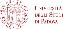

### 27th - 29th May 2026, Università degli Studi di Padova

# Overview

This is a multidisciplinary, advanced workshop designed for Master students in QuaC Biosciences, as well as Master students from other backgrounds, PhD students, and early-career researchers with an interest in image analysis and solid foundational knowledge of the field. The workshop will combine [FIJI](https://fiji.sc) and [Python](https://www.python.org/)-based workflows and will use datasets spanning cell biology to ecology. In particular, we will focus on two distinct types of advanced analysis: 3D cellular imaging and the tracking of particles or organisms in complex environments. Each day will include guided demonstrations and hands-on practical work.

# Instructors
* [Stefania Marcotti, Francis Crick Institute](https://www.linkedin.com/in/stefania-marcotti/)

# Preparation

1. Please remember to bring your laptop (and charger)
2. Ensure your laptop can connect to WiFi networks 
3. Please install the required software before the workshop - follow the installation instructions on [this page](Pages/Installation-Instructions.md).
4. Download the workshop data by clicking on the link to the ZIP archive at the top of this page.
5. **PLEASE CONTACT US BEFORE THE WORKSHOP IF YOU ENCOUNTER ANY DIFFICULTIES WITH ANY OF THE ABOVE.**

# Program (draft)

<table style="width:100%">
	<tbody>
		<tr>
			<th colspan=3>Wednesday, May 27th 2026</th>
		</tr>
		<tr>
			<td>09:30 - 11:00</td>
			<td>Session 1</td>
			<td>
Introduction & Installations
</td>
		</tr>
		<tr>
			<td></td>
			<td colspan=3>
				<ul>
					<li>Who are you and why are you here?</li>
					<li>Creating Python environments</li>
					<li>Why manual analysis is a bad idea</li>
					<li>Embracing uncertainty</li>
					<li>What is metadata and why do you need it</li>
					<li>Version control and reproducibility</li>
				</ul>
			</td>
		</tr>
		<tr>
			<td>11:00-11:15</td>
			<td colspan=2>Coffee Break</td>
		</tr>
		<tr>
			<td>11:15-12:45</td>
			<td>Session 2</td>
			<td>
Image Pre-Processing, Segmentation & Analysis using Fiji
</td>
		</tr>
		<tr>
			<td></td>
			<td colspan=3>
				<ul>
					<ul>
						<li>Basic segmentation using thresholding</li>
						<li>Use of filtering to suppress noise</li>
						<li>Obtaining numbers from images</li>
						<li>Counting and quantifying morphology of objects</li>
						<li>Quantifying fluorescence intensities</li>
					</ul>
				</ul>
			</td>
		</tr>
		<tr>
			<td>12:45 - 13:45</td>
			<td colspan=2>Lunch</td>
		</tr>
		<tr>
			<td>13:45 - 15:15</td> 
			<td>Session 3</td>
			<td>
Image Pre-Processing, Segmentation & Analysis using Python
</td>
		</tr>
		<tr>
			<td></td>
			<td colspan=3>
			<ul>
				<ul>
					<li>Introduction to Jupyter notebooks</li>
					<li>Scripting foundational concepts</li>
					<li>Quantifying morphology of objects in a 2D image</li>
				</ul>
			</ul>
			</td>
		</tr>
		<tr>
			<td>15:15 - 15:30</td>
			<td colspan=2>Coffee Break</td>
		</tr>
		<tr>
			<td>15:30 - 17:00</td> 
			<td>Session 4</td>
			<td>
Automating Image Analysis Workflows using Python
</td>
		</tr>
		<tr>
			<td></td>
			<td colspan=3>
			<ul>
				<ul>
					<li>Practical application: analysing all the images in a folder</li>
				</ul>
			</ul>
			</td>
		</tr>
		<tr>
			<th colspan=3>Thursday, May 28th 2026</th>
		</tr>
		<tr>
			<td>09:30 - 11:00</td>
			<td>Session 5</td>
			<td>
Extending the Analysis to Three-Dimensions in Fiji
</td>
		</tr>
		<tr>
			<td></td>
			<td colspan=3>
				<ul>
					<li>Counting and quantifying morphology of objects in 3D</li>
					<li>Quantifying fluorescence intensities in 3D</li>
				</ul>
			</td>
		</tr>
		<tr>
			<td>11:00-11:15</td>
			<td colspan=2>Coffee Break</td>
		</tr>
		<tr>
			<td>11:15-12:45</td>
			<td>Session 6</td>
			<td>
Visualising Image Data using napari
</td>
		</tr>
		<tr>
			<td></td>
			<td colspan=3>
				<ul>
					<ul>
						<li>Overview of the napari GUI</li>
						<li>Visualising complex datasets</li>
						<li>Extending napari capabilities with plugins</li>
					</ul>
				</ul>
			</td>
		</tr>
		<tr>
			<td>12:45 - 13:45</td>
			<td colspan=2>Lunch</td>
		</tr>
		<tr>
			<td>13:45 - 15:15</td> 
			<td>Session 7</td>
			<td>
Analysing Three-Dimensional Data using Python
</td>
		</tr>
		<tr>
			<td></td>
			<td colspan=3>
			<ul>
				<ul>
					<li>Counting and quantifying morphology of objects in 3D</li>
					<li>Quantifying fluorescence intensities in 3D</li>
				</ul>
			</ul>
			</td>
		</tr>
		<tr>
			<td>15:15 - 15:30</td>
			<td colspan=2>Coffee Break</td>
		</tr>
		<tr>
			<td>15:30 - 17:00</td> 
			<td>Session 8</td>
			<td>
3D Exercise
</td>
		</tr>
		<tr>
			<td></td>
			<td colspan=3>
			<ul>
				<ul>
					<li>Practical application: quantifying 3D image data</li>
				</ul>
			</ul>
			</td>
		</tr>
		<tr>
			<th colspan=3>Friday, May 29th 2026</th>
		</tr>
		<tr>
			<td>09:30 - 11:00</td>
			<td>Session 9</td>
			<td>
Tracking Objects in Fiji
</td>
		</tr>
		<tr>
			<td></td>
			<td colspan=3>
				<ul>
					<li>Overview of tracking algorithms</li>
					<li>Using TrackMate</li>
					<li>Analysing tracks and visualising results</li>
				</ul>
			</td>
		</tr>
		<tr>
			<td>11:00-11:15</td>
			<td colspan=2>Coffee Break</td>
		</tr>
		<tr>
			<td>11:15-12:45</td>
			<td>Session 10</td>
			<td>
Tracking Exercise
</td>
		</tr>
		<tr>
			<td></td>
			<td colspan=3>
				<ul>
					<ul>
						<li>Practical application: tracking objects</li>
					</ul>
				</ul>
			</td>
		</tr>
		<tr>
			<td>12:45 - 13:45</td>
			<td colspan=2>Lunch</td>
		</tr>
		<tr>
			<td>13:45 - 15:15</td> 
			<td>Session 11</td>
			<td>
Q&A
</td>
		</tr>
	</tbody>
</table>

# Venue

The workshop will take place in the Fiore Di Botta and Vallisneri building, Padua, Italy.

	 

